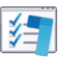
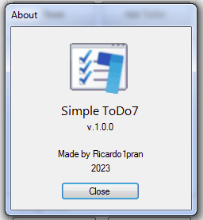

# Simple ToDo7

<i>Simple ToDo7 Logo, the 7 is inspired from Microsoft To-Do logo</i>

Simple ToDo7 is a To-Do Application made natively for Windows 7. The main purpose is to help you have a handy yet simple to-do application for your Windows 7 environtment. The second purpose is to help inspire new or learner programmers to study or create a simple yet useful utility applications.

(Note: See screenshots below)

## Background

I'm currently having nostalgic moments by installing old operating systems in a Virtual Machine and using them as my daily OS. While using Windows Vista, I created "ToDo Vista" which you can see [here](https://github.com/ricardo1pran/ToDoVista). After a while in Windows Vista exploring the features I've known and neven known before, it's time for me to move to Windows 7. But now I feel incomplete, and wanted to improve my ToDo Vista better. But because now I'm using Windows 7, it's time to create the better version as a separate application.

## Features

I call a task in this application as a "ToDo". Anything mentioned as "ToDo" inside the app, means the task. There are features that's already exist in ToDo Vista tho, so I'll make the features that only available in Simple ToDo7 as italic. See the list of the features below:

- Add ToDo
- Complete ToDo
- Delete ToDo
- <i>Edit existing ToDo</i>
- Save ToDo list to a .txt file
- <i>Clear existing ToDo list</i>
- <i>Move ToDo items in the list up and down</i>
- <i>A simple How To Guide in Help context menu</i>
- <i>See completed ToDo as separate list</i> (upcoming feature!)
- <i>Set in-app preferences</i> (upcoming feature in v.1.1.0!)

<i>The preferences will be able to set some options such as toggle Skip Completed ToDo in Txt, toggle Set Completed ToDo always on buttom, etc.</i>

## Technical Requirements

There are no specific requirements for this application, I believe it will run on Windows 7 and newer machines, so I'll just mention the tools I used to create this application.

- Microsoft Visual C# Express 2010
- Microsoft .NET 4.5

## Application Support and Updates

I'll still be in Windows 7 operating system until September 2023, so expect the "upcoming" features to be done before September 30th. After that I'll move to Windows 8.1, and maybe create a newer modern ToDo application.

## Usage

As stated on the license I chose. Plus you're free to contact me [here](contact@ricardogunawan.com) if you think you want to use my apps for other purposes. Usage for study purposes are always welcome.

## Screenshots

 
<i>Simple ToDo7 Main App View</i>

 
<i>Simple ToDo7 Complete a ToDo</i>

 
<i>Simple ToDo7 edit a ToDo</i>

 
<i>Simple ToDo7 delete a ToDo</i>

 
<i>Simple ToDo7 Save as menu</i>

 
<i>Simple ToDo7 Save as dialog</i>

 
<i>Simple ToDo7 saved .txt file</i>

 
<i>Simple ToDo7 Clear ToDo (confirmation)</i>

 
<i>Simple ToDo7 v.1.0.0 New Modern and Clean About (compared to ToDo Vista)</i>